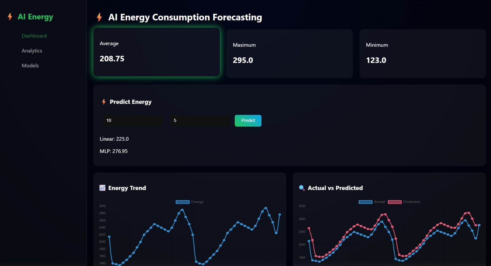
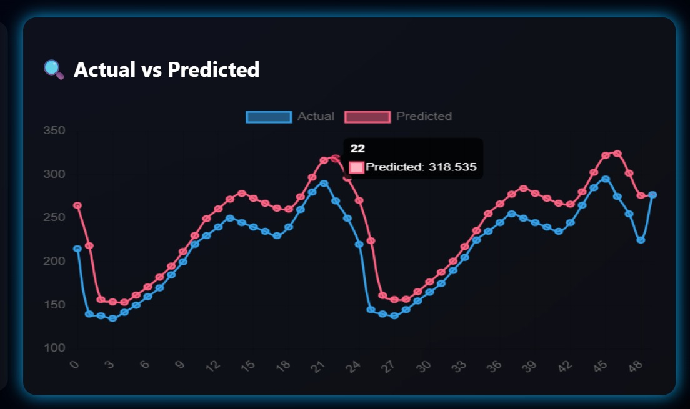
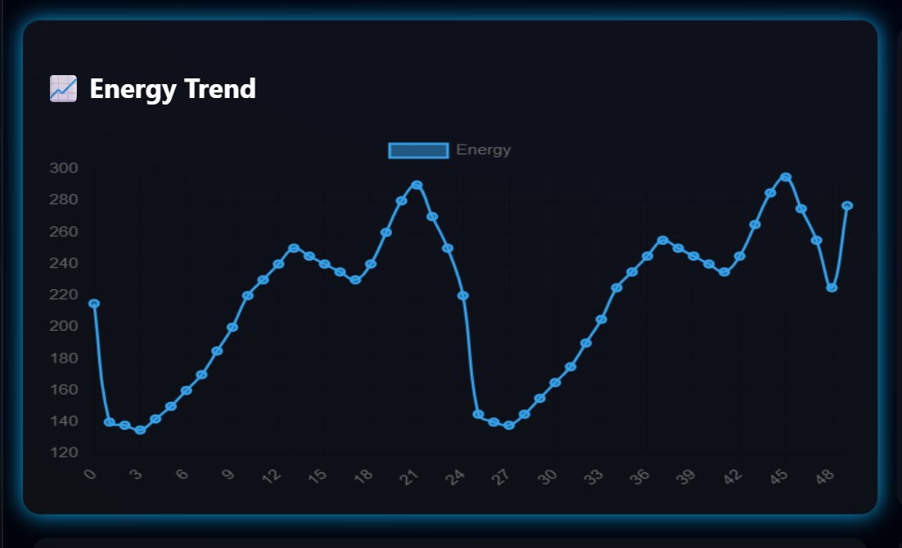
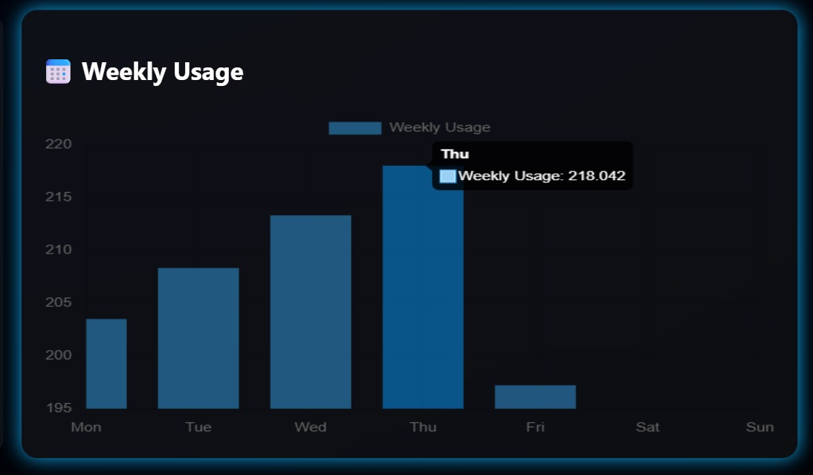
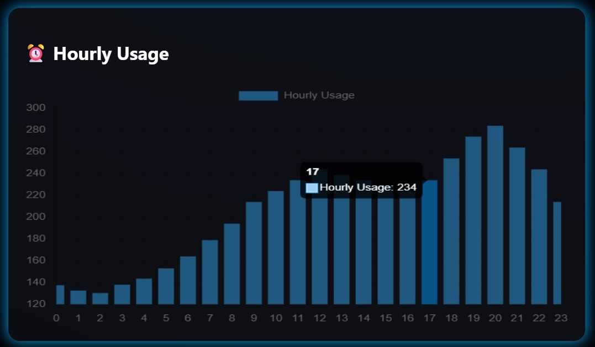
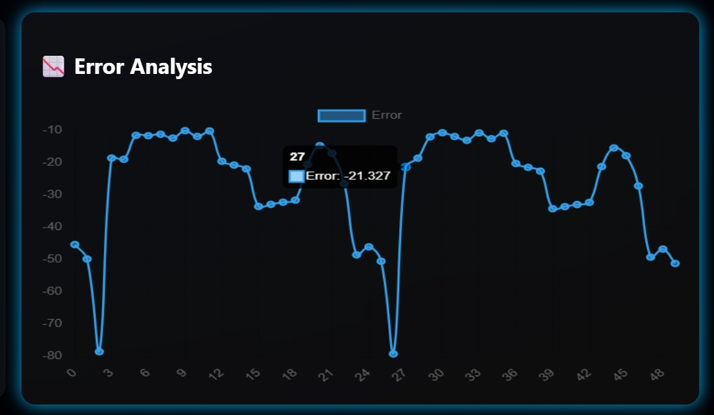

# ⚡ AI-Powered Energy Consumption Forecasting

## 📌 Overview
The AI-Powered Energy Consumption Forecasting project is a machine learning-based system designed to predict future energy consumption using historical data.  
It helps in understanding usage patterns, reducing energy wastage, and improving smart energy management systems.

This project uses machine learning techniques in Python to analyze past energy usage and generate accurate future predictions.

---

## 🚀 Features
- Predicts future energy consumption using historical data  
- Visualizes energy usage trends and patterns  
- Machine learning-based forecasting model  
- Data preprocessing and feature engineering  
- Model evaluation using performance metrics  
- Can be integrated into smart dashboards  

---

## 🧠 Tech Stack

| Tool | Purpose |
|------|---------|
| Python 3.10 | Core language |
| Pandas + NumPy | Data preprocessing |
| Scikit-learn | MLP Neural Net + Random Forest |
| Matplotlib + Seaborn | Visualizations |
| Flask | REST API deployment |
| Joblib | Model serialization |


---

## 📂 Project Structure
```
AI-Energy-Forecasting/
│
├── data/
│   └── energy.csv
│
├── models/
│   └── model.pkl   (auto-created after training)
│
├── src/
│   ├── data_loader.py
│   ├── features.py
│   ├── train.py
│   ├── predict.py
│
├── app/
│   ├── app.py
│   ├── templates/
│   │   └── index.html
│   ├── static/
│   │   └── style.css
│
├── outputs/
│   └── (graphs/images)
│
├── requirements.txt
├── README.md
└── main.py
```


---

## ⚙️ Installation & Setup

### 1. Clone the repository

git clone https://github.com/sakshimaurya2306-commits/AI-Powered-Energy-Forecasting.git


### 2. Install dependencies

pip install -r requirements.txt


### 3. Run the project
python  main.py
python -m app.app
or
python app/app.py


---

## 📊 How It Works
1. Load historical energy consumption data  
2. Clean and preprocess the dataset  
3. Train a machine learning model  
4. Evaluate model performance  
5. Predict future energy consumption  
6. Visualize results using graphs  

---

## 📈 Results
- Accurate prediction of energy consumption trends  
- Better understanding of usage patterns  
- Useful insights for energy optimization  

---

## 🔮 Future Improvements
- Real-time energy prediction system  
- IoT integration with smart meters  
- Deep learning (LSTM-based forecasting)  
- Cloud deployment for scalability  

---

## 📸 Screenshots


---


---


---


---


---



---

👨‍💻 Author

Sakshi Ramakabal Maurya B.Tech in Information Technology at K.j. Somaiya institute of technology

